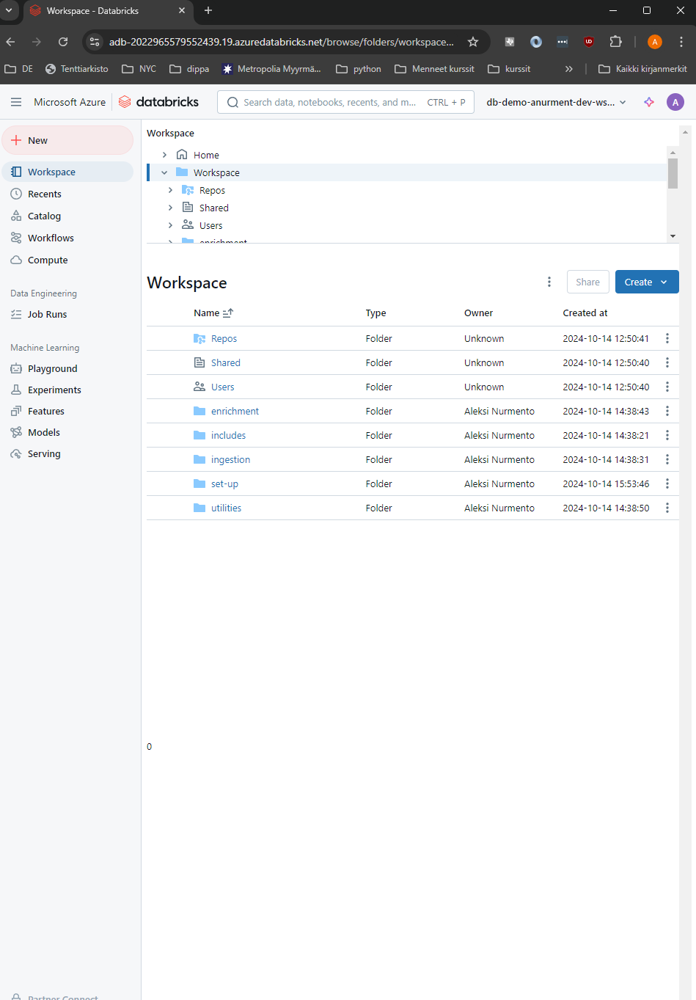
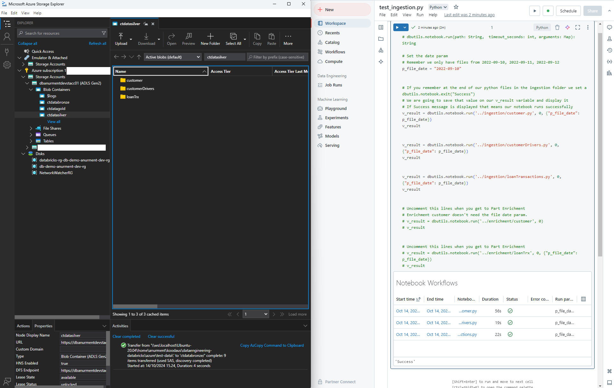
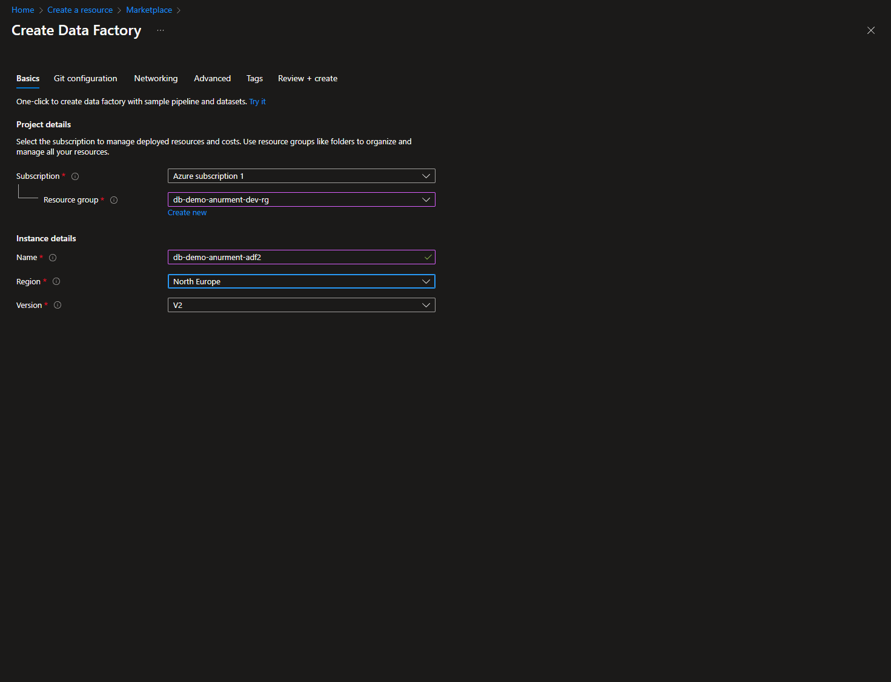
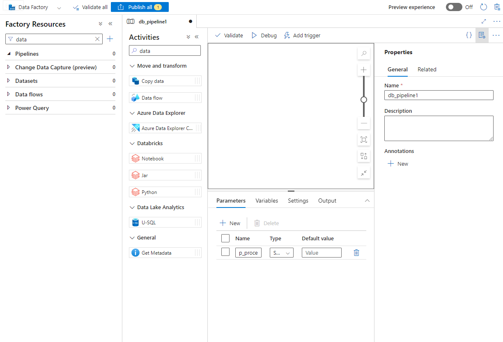
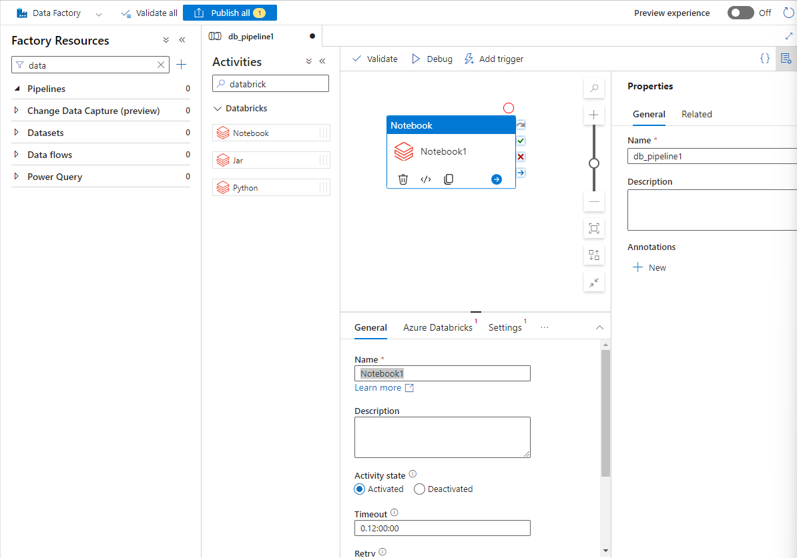
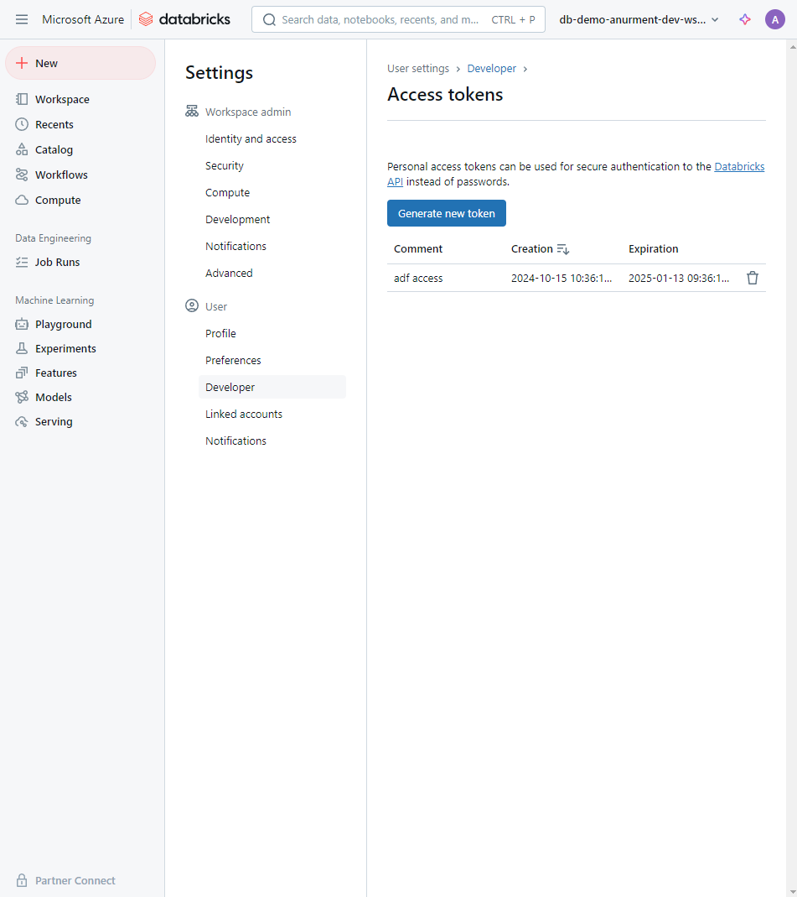

# Build an Azure Databricks ETL pipeline with Terraform and Azure Data Factory  
  
### Project Overview  
  
NOTICE: This project is meant to be just a simple example in building the Azure/Databricks infrastucture and the ETL pipeline. Some important steps, configurations etc. are omitted from this project regarding a production environment. This project will be refined and improved by for e.g setting up virtual network, unity catalog, restructure of the terraform files for better reusability etc.   

  
### Project Steps:    
  
1. Setup and build some infrastructure in Azure for a data pipeline via Terraform. We will use the [medallion architecture](https://www.databricks.com/glossary/medallion-architecture) for the pipeline.   
  
2. Write some notebooks in Azure databricks for data ingestion, transform and enrichment.  
  
3. Create an Azure Data Factory pipeline that executes the Databricks notebooks against the Databricks jobs cluster.  
  
### Prerequisites:  
   
- Azure account (this project is done with free trial)  

- [Azure CLI installed](https://learn.microsoft.com/en-us/cli/azure/install-azure-cli)  

- [Terraform installed](https://developer.hashicorp.com/terraform/install)  
  
  
### Overview of the Terraform IaC files  
  
In `databricks` folder you will find 4 terraform files for building the needed resources. You can follow the comments and check the [Terraform registry](https://registry.terraform.io/) for additional information about the commands.  
  
- provider.tf:  
    - Here we configure the required providers that terraform utilizes in building the infrastructure.    
    - NOTE: the `azurerm`-provider needs the subscription_id from your azure account. It will be asked when we use the `terraform plan` and `terraform apply` commands.   
  
- main.tf:  
Here we will configure the following resources for the project:
    1. Resource Group  
    2. Storage Account  
    3. Bronze, Silver and Gold containers for the medallion architecture.  
    4. Databricks Workspace  
    5. Azure Key Vault  
    6. Service Principal  
    7. Databricks Cluster
  
- variables.tf:  
Here we declare the different variables needed for the configuration.    
  
-terraform.tfvars:  
Here we can set the variables we declared in variables.tf.  
  
### Part 1 - Build the infrastucture with terraform:  
  
1. First authenticate with Azure CLI and select your subscription id by running the command:  
`az login`  
  
2. Run the command: `terraform init`  
  
3. Set the required variables in terraform.tfvars.    
  
4. Run the command: `terraform plan`  
    - You will be asked to provide the subscription id for `azurerm provider`. You can get it with the command: `azure account list`. The subscription id is the `"id": "XXXXXXXX-XXXX-XXXX-XXXX-XXXXXXXXXXXX"`  
  
5. Run the command: `terraform apply`.  Again, provide the subid.  
  
Terraform will now build the resources. This can take some time.  
  
### Part 2 - Overview of the test data and its use case used in this project:   
  
When the terraform is building the infrastructure we can take a look at the test data we are using in this project:  
  
unzip the test-data.zip file, for e.g with unzip:  
`unzip test-data.zip -d .`  
  
We have three different types of csv-files consisting of fake banking data. Customer data is treated with the update and insert-technique and the other two are loaded incrementally:  
  
Customer:  
  
-customerId: unique identifier  
-firstName: name  
-lastName: last name  
-phone: home phone number  
-email: email  
-gender: Male or Female  
-address: place where the customer lives  
-is_active: flag that indicates if the  client is with us  
  
Customer Drivers:  
  
-date: date that the data was generated by RiskModeling area  
-customerId: unique identifier of the  customer  
-monthly_salary: monthly salary in USD  
-health_score: score - how important is the customer for the bank  
-current_debt: current debt that the  customer has with our bank  
-category: segment of the customer  
  
Loan Transactions:   
-date: date of the transaction  
-customerId: unique identifier of the customer  
-paymentPeriod: term of the loan  
-loanAmount: amount requested by the customer  
-currencyType: currency of the loan (USD, EUR)  
-evaluationChannel: channel by which the loan was sold  
-interest_rate: rate of the loan  
  
Our goal is to:  
1. Provide the Banks Marketing team updated customer data.  
2. Provide the Banks Finance team daily load transactions complemented with customer drivers.   
  
Our architecture:  
  
**Bronze:** Store the raw data in original format.  
**Silver:** Store the transformed data in delta format.    
**Gold:** Store the enriched data in delta format.  

  
### Part 3 - Add some folders and notebooks to your Databricks workspace   
  
When the terraform build process is complete, search for `Azure Databricks` in your Azure Portal and select your newly created workspace. Click on `Launch Workspace`. From the left sidebar click on `workspace` and create five folders inside the workspace-folder:  
- includes  
- ingestion  
- enrichment  
- utilities   
- set-up  
  
  
  
  
### Part 4 - Upload data to the bronze container  
  
For illustration purposes we are going to use [Azure Storage Explorer](https://azure.microsoft.com/en-us/products/storage/storage-explorer/#overview) to upload the files to the bronze container.  Download, install it and connect your account. 
  
From the explorer in the left side of the window we can find our containers:  
  
  
  
Drag and drop the three folders `customer`, `customerDriver` and `transactions` in the bronze container.  
  
### Part 5 - Data ingestion    
  
- In your databricks workspace, in the `includes`-folder create the following notebooks:  
-**common_functions.py**  
-**configurations.py**  
  
- In your databricks workspace, in the `ingestion`-folder create the following notebooks:  
-**customer.py**  
-**customerDrivers.py**  
-**loanTransactions.py**    

 
  
You can find the code for all the notebooks in the local workspace in folder `notebooks`. Read code comments.  
  
- **common_functions.py:**  
    Function for inserting a timestamp column to a dataframe  
    
  
- **configurations.py:**  
    Fill in the correct path to your containers. Check the comment for help.   
  
- **customer.py**, **customerDrivers.py**  and **loanTransactions.py**:  
    In these notebooks we do some transformations and save the data in delta format in our silver container.  
    NOTE: each of the %run magic commands must be in an isolated code block.  

  
### Part 6 - Testing the Data ingestion  
- In your databricks workspace, in the `utilities`-folder create the following notebook:  
-test_ingestion.py  
  
Copy and paste the code from your local file `/notebooks/utilities/test_ingestion.py` to the notebook.  
  
Run the `test_ingestion` notebook and check that the data has been stored in the silver container:  
  
  
  
  
### Part 7 - Enrichment  
  
- In your databricks workspace, in the `set-up`-folder create the following notebook: 
  
-**database.py**  
  
- In your databricks workspace, in the `enrichment`-folder create the following notebook:  
-**customer.py**  
-**loantTrx.py**  
  
   
  
You can find the code for all the notebooks in the local workspace in folder `notebooks`. Read code comments.  
  
- **database.py:**  
  Creates the database for the gold container.NOTE: remember to separate the %run magic command to a separate cell.    
  
- **customer.py:**  
  Here we load the customer data from the silver container, add a timestamp and save the data frame to the gold container. After this we create a master customer table in our database.  

  
- **loanTrx.py:**  
  Here we load and join the customerDrivers and loanTrx data frames in order to enrich our transactional data. We add a timestamp to the joined dataframe, save our featureLoanTrx dataframe in the gold container and create a sql table for later queries. Then we are going to do some aggregations from the featureLoanTrx dataframe, add a timestamp, save the aggLoanTrx dataframe in the gold container and create a sql table for later queries.   
  
  
### Part 8 - Testing the enrichment  
  
Execute the database.py notebook first. After this we can test the whole pipeline by uncommenting the last lines from the test_ingestion.py notebook.  
  
Check for errors and that the files have been saved from Azure Storage Explorer.  
  
### Part 9 - Data Factory
  
Go to azure portal and create a new resource. Search for `data factory` and click on create. Select the subscription, resource group and the region. You can leave the configuration in the other tabs as is:  
  
  
  
In your azure portal, navigate to the data factory you just created and click on `launch studio`.  
  
Steps for creating the time triggered pipeline:  

1.  In the Data Factory studio create a new pipeline and rename it.  

2. Add a new Parameter `p_processing_date` to the pipeline:   

  

3. Search for databricks in the `Activities` search bar. Drag and drop the Notebook in to the empty canvas:  

4.  Create an access token to the databricks cluster:
-  In your Databricks workspace, from the top right account icon, select `Settings`.  
-  Under the User-title select `Developer` --> `Access tokens` --> `Manage` --> `Generate new token`. Copy the token. See the below image:  

  

5.  Add a linked service to your notebook:  

-  In Data Factory page, select the notebook that you placed on the canvas. Rename it and add a new linked service:

[adf_canvas2](./img/adf_canvas2.png)

-  Fill in/select the options like so: 

[adf_canvas3](./img/adf_canvas3.png)  
  

-  Fill in the Access token you just created.  
-  If the ****Choose from existing clusters** part is empty and does not seem to find the cluster based on the name of the cluster, go to **Compute**-page in your Databricks workspace and find the cluster id from the json-information file associated to your cluster.  Copy and paste the cluster id to the form. Click on create.  

6.  Add the notebook path to your notebook activity from the **Settings**- tab:

[adf_canvas4](./img/adf_canvas4.png)  
  
7.  Add the **p_file_date** parameter to the Base parameters in **Settings**-tab:
    -  Click on the empty value form and **Add a dynamic expression**: `@formatDateTime(pipeline().parameters.p_processing_date, 'yyyy-MM-dd')`

[adf_canvas5](./img/adf_canvas5.png)  
  

8. Now you can select and copy/paste the created notebook to the canvas, change the name and the associated notebook path and create all the other notebook activities:  

[adf_canvas6](./img/adf_canvas6.png)

NOTE: Remember that the enrichment_customer does not take in the **p_file_date** -parameter.  
  
9. Create a trigger to run the pipeline automatically:  

-  Go to Manage > Triggers > New  
-  Select the schedule when the pipeline is to ne run. For e.g:   
  
[trigger1](./img/trigger1.png)  
  
10.  Associate the trigger to your pipeline. Above the pipeline canvas > Add trigger:  

[trigger2](./img/trigger2.png)

  
After clicking OK, you will be asked for the **p_processing_date** -parameter. Fill in: `@trigger().outputs.windowEndTime`  
  
If you selected the pipeline to be triggered, lets say five minutes from now. You can go to the Azure Storage explorer, delete the data in the silver and Gold containers and observe if the pipeline is functioning correctly when it is triggered.  

### END   
  
Many techologies and working practices were used in this project. Some future improvements in mind:  

-  Automate the whole infrastructure building, uploading of the notebooks and the pipeline automation with terraform.  
-  Add some other technologies for other use cases, for e.g. Kafka.  

  

 

