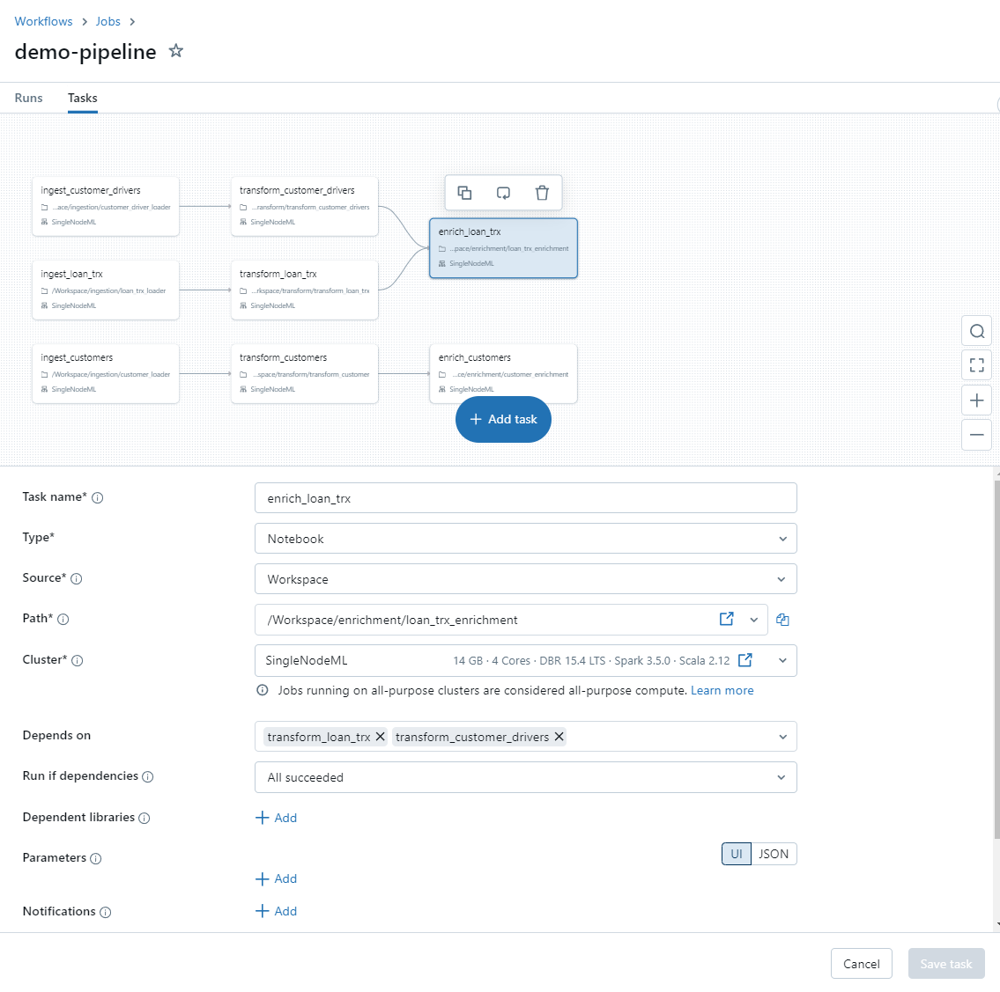
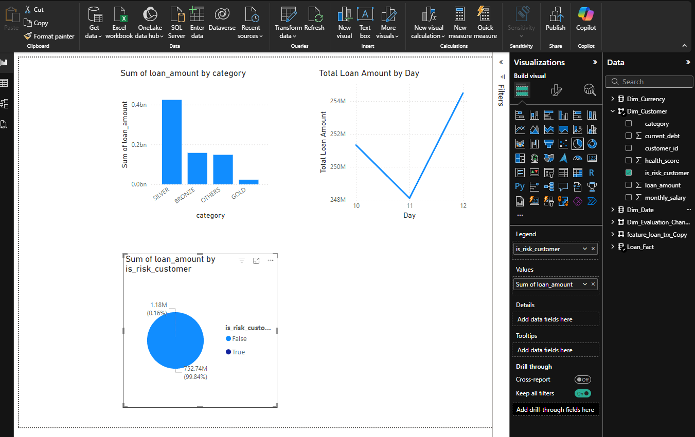

# Build an Azure Databricks LakeHouse with Terraform and implement an ETL pipeline.
  
## Project Overview 

- Keywords / Tech stack: Azure, Azure cli, Azure Data Factory, Databricks, Terraform, Spark, Kafka, ML, Python, SQL.  
  
NOTICE: This project is meant to be just a simple example in building the Azure/Databricks infrastucture and the ETL pipeline. Some important steps, configurations etc. are omitted from this project regarding a production environment. This project will be refined and improved by for e.g restructure of the terraform files for better reusability etc.  
  
Under the **Project Main Steps** are the implemented parts. In the near Future I will implement: 
- SQL database for data source with Data Factory connection.
- Kafka streaming from a NASA API.
- ML pipeline.  

  
### Project Main Steps:    
  
1. Setup and build some infrastructure in Azure for a data pipeline via Terraform. We will use the [medallion architecture](https://www.databricks.com/glossary/medallion-architecture) for the pipeline. 

2. Setup the Databricks workspace for Catalogs etc.
  
2. Write some notebooks in Azure databricks for data ingestion, transform and enrichment of fake banking data.  

TODO!!!!  
3. Setup a workflow in Databricks for automating the pipeline.

4. Share the gold level data with Delta Share to Power BI.

5. Construct a Power BI report.  
  
### Prerequisites:

- Azure account (this project is done with free trial)  

- Admin rights to your Azure Databricks account, see: https://learn.microsoft.com/en-us/azure/databricks/data-governance/unity-catalog/manage-privileges/admin-privileges

- [Azure CLI installed](https://learn.microsoft.com/en-us/cli/azure/install-azure-cli)  

- [Terraform installed](https://developer.hashicorp.com/terraform/install)  

- Some basic knowledge of azure and terraform is preferred but if you are not familiar with Azure, Databricks, terraform or any other tech used in here, I suggest that you reference the [Microsoft Learn](https://learn.microsoft.com/en-us/), [Databricks Resources](https://www.databricks.com/resources) and [Terraform](https://www.terraform.io/) official pages if you do not understand something. There is a lot of outdated information in youtube, blogs, etc. so I would avoid those as a source material in learning.  

- The local workspace for this project is WSL2 Ubuntu-20.04, so bash commands are used here.

### Overview of the Terraform IaC files  
  
In `terraform/adb-vnet-injection` folder you will find terraform files for building some resources. You can follow the comments and check the [Terraform registry](https://registry.terraform.io/) for additional information about the commands. 

We will configure the following resources for the project:

- Unity catalog with Metastore (created automatically).  
- Main Resource Group for our Databricks workspace etc.  
- Storage Account for external storage with a container.   
- Vnet-injected Databricks Workspace with some predefined folders.  
- Databricks Cluster.  
- Azure Data Factory (**note: this is not used yet in the project**).  

File overview:  

- **module-filder**:
    - module for creating the Databricks cluster.  

- **azure_data_factory.tf**:  
    - Azure data Factory resource.  

- **data.tf**:  
    - Some needed data sources for configurations etc.  

- **extstorage.tf**:  
    - Resources for the external storage (data source).  

- **main.tf**:
    - Versioning for the providers etc.  

- **outputs.tf**:
    - Some output variables.  
 
- **providers.tf**:    
    - Here we configure the required providers that terraform utilizes in building the infrastructure.    
    - **NOTE**: the `azurerm`-provider needs the **subscription_id** from your azure account. It will be asked when we use the `terraform plan` and `terraform apply` commands.   
 
- **variables.tf**:  
    - Here we declare the different variables needed for the configuration.    
  
- **terraform.tfvars**:  
    - Here we can set the variables we declared in variables.tf.  

- **vnet.tf**:  
    - Private network for the Databricks workspace.  

- **workspace.tf**:  
    - Resources for the Databricks workspace.  
  
### Part 1 - Build the infrastucture with terraform:  
  
1. First authenticate with Azure CLI and select your subscription id by running the command:  
`az login`  
  
2. Cd to the `terraform/v-net-injection`-folder and run the command: `terraform init`  
  
3. Set the required variables in terraform.tfvars.    
  
4. Run the command: `terraform plan`  
    - You will be asked to provide the subscription id for `azurerm provider`. You can get it with the command: `azure account list`. The subscription id is the `"id": "XXXXXXXX-XXXX-XXXX-XXXX-XXXXXXXXXXXX"`  
  
5. Run the command: `terraform apply`.  Again, provide the subid.  
  
Terraform will now build the resources. This can take some time.  
  
### Part 2 - Overview of the test data and its use-case used in this project:   
  
When the terraform is building the infrastructure we can take a look at the test data we are using in this project:  
  
- unzip the `test-data.zip`-file in the `data`-folder , for e.g with unzip:  
command:  `unzip test-data.zip -d .`  
  
We have three different types of csv-files consisting of fake banking data. Customer data is treated with the update and insert -technique (UPSERT) and the other two are loaded incrementally:  
  
**Customer:**  
  
-customerId: unique identifier  
-firstName: name  
-lastName: last name  
-phone: home phone number  
-email: email  
-gender: Male or Female  
-address: place where the customer lives  
-is_active: flag that indicates if the  client is with us  
  
**Customer Drivers:** 
  
-date: date that the data was generated by RiskModeling area  
-customerId: unique identifier of the customer  
-monthly_salary: monthly salary in USD  
-health_score: score - how important is the customer for the bank  
-current_debt: current debt that the  customer has with our bank  
-category: segment of the customer  
  
**Loan Transactions:**   
-date: date of the transaction  
-customerId: unique identifier of the customer  
-paymentPeriod: term of the loan  
-loanAmount: amount requested by the customer  
-currencyType: currency of the loan (USD, EUR)  
-evaluationChannel: channel by which the loan was sold  
-interest_rate: rate of the loan  
  
Our goal is to:  
1. Provide the Banks Marketing team updated customer data.  
2. Provide the Banks Finance team daily load transactions complemented with customer drivers.   
  
Our architecture in DataBricks:  
  
**Bronze:** Store the raw data in original format.  
**Silver:** Store the transformed data in delta format.    
**Gold:** Store the enriched data in delta format.  

  
### Part 3 - Add some folders Catalogs and schemas to your Databricks workspace   
  
1. Find your newly created Databricks workspace inside the created resource group in Azure portal and log in.  
2. From the left sidebar select **Catalog**,click on the **+**-button and **Add a catalog**. Remember to select the Storage location of your workspace.  
3. Create 3 catalogs: **bronze_catalog**, **silver_catalog**, **gold_catalog**.  
4. Inside bronze catalog create 3 schemas for the raw data: customer, customer_driver, loan_trx.  
5. Create the same schemas to silver and gold catalogs.  
NOTE: if you encounter problems creating the catalogs, ensure that you have the Admin rights from your [databricks account portal](https://accounts.azuredatabricks.net/). Remember that you have to login with an account that has the Global Administrator Role.   

### Part 4 - Add a storage credential and an external location

1. From the left sidebar select **Catalog**,click on the **+**-button and **Add a storage credential**.  
2. Fill the form like so:  
    - Credential Type: Azure Managed Identity.  
    - Storage credential name: `some name`  
    - Access connector ID: In the Azure Portal > resource group we created > access connector >  copy and paste the Resource ID  
3. From the left sidebar select **Catalog**,click on the **+**-button and **Add an external location**.  
4. Fill the form like so:  
    - External location name: `some name`  
    - Storage credential: pick the one you just created.  
    - URL: `abfss://<containername>@<storage_account_name>.dfx.windows.net/`. You can find the **storage_account_name** and **containername** for your external storage from your azure portal in the same resource group.  
  
  
### Part 5 - Upload data to the external location 

  
Create three folders `customer`, `customerDriver` and `transactions` and add one file from the test-data in each of them in the external container in Azure portal > external storage account > external container > upload.  You should see the data now in your: Databricks workspace > Catalog > External Data > external location > Browse. You can test that the cluster can access the external location by opening a notebook and running command: `dbutils.fs.ls("abfss://<containername>@<storage_account_name>.dfx.windows.net/")`.  
  
### Part 6 - Data ingestion - (TO BRONZE)   

- From `notebooks`-folder you can find all the notebooks used in this tutorial. The same folders were created in your workspace by Terraform already.
  
- In your databricks workspace, in the `includes`-folder create the following notebooks:   
    - **configurations.py** 
        - The filepath for the external location is read from here. `abfss://<containername>@<storage_account_name>.dfx.windows.net/"`
  
- In your databricks workspace, in the `ingestion`-folder create the following notebooks:  
    - **customer_loader**:     
        - customer_yyyy-MM-dd.csv files are ingested to the bronze catalog with UPSERT technique using Auto Loader, see: [What is Auto Loader?](https://docs.databricks.com/en/ingestion/cloud-object-storage/auto-loader/index.html).  
    - **customer_driver_loader**:    
        - customerDrivers_yyyy-MM-dd.csv files are ingested incrementally to the bronze catalog using Auto Loader.  
    - **loan_trx_loader**:  
        - loanTrx_yyyy-MM-dd.csv files are ingested incrementally to the bronze catalog using Auto Loader.  

- In the `transform`, `enrichment`, `set-up` and folder do the same copy-pasting. In these notebooks we make some transformations, enrichment etc. See the code comments for more details.   

- **NOTE**: each of the %run magic commands must be in an isolated code block.  

  
### Part 7 - Testing the Data ingestion  

- Run the code in your `set-up/create_bronze_tables` notebook to initialize the schema for the UPSERT technique to work.  
  
Run the notebooks in `ingestion`-folder and see if the data is loaded from the external data source to the bronze level catalogs.   

### Part 8 - Transformations (TO SILVER)  
  
- In the `transform`-folder you can find the code for the data cleaning and transformations for the silver layer.  See the code comments for more details. Similar to the PART 6, test the transformation process by running the notebooks.  

### Part 9 - Enrichment (TO GOLD)

- In the `enrichment`-folder you can find the code for the data cleaning and transformations for the silver layer.  See the code comments for more details. Similar to the PART 6, test the transformation process by running the notebooks.
  
  
### Part 10 - Setting up Databricks Workflow for automation  

1. In your Databricks portal navigate to **Workflows** > **Create Job**  
2. see [Step 6: Create a Databricks job to run the pipeline](https://docs.databricks.com/en/getting-started/data-pipeline-get-started.html) and follow the instructions. It should be pretty simple. Remember that for free trial account you might have a cpu limit so you have to select the same cluster we created.  Remember to add more files to the external storage container.  
  
Workflow:  

  

3. see [Step 7: Schedule the data pipeline job](https://docs.databricks.com/en/getting-started/data-pipeline-get-started.html) for automating the job.
4. Observe that the pipeline is correctly.  

NOTE: If you running to problems and in general if you want to test the pipeline you can delete tables, Auto Loader checkpoints and re-initialize the bronze tables by running the code in the `set-up` files.  

### Part 11 - Setting up Delta Sharing for Power BI  

1. See [Create and manage shares for Delta Sharing](https://learn.microsoft.com/en-us/azure/databricks/delta-sharing/create-share#add-tables). Follow the instructions in order to share your gold level tables to power BI.  

### Part 12 - Power BI report  

1. Open the shared tables in power BI, see [Delta Sharing](https://learn.microsoft.com/en-us/power-query/connectors/delta-sharing)  

2. Create for example a Star Schema and some visualizations:  

  

### END (for now)
  

  

 

